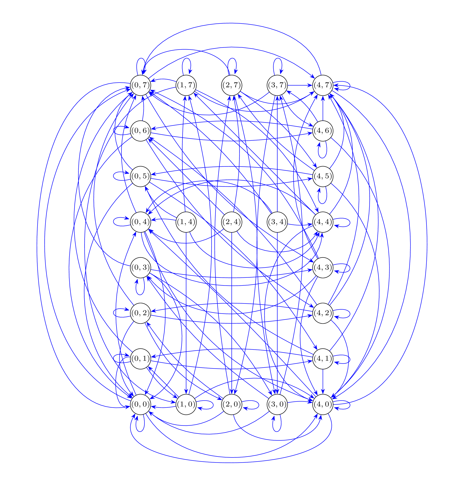

One of these days a friend mentioned this internet puzzle, which can be stated as follows: _You have two buckets. One bucket with a capacity of 4 L, and another with 7 L. Using only these two buckets, you are asked to obtain exactly 6 L of water._ The problem establishes that _you have infinite water, and can waste as much of it as you want, as long as you respect the two following rules_ 
1. _When filling up a bucket or throwing its contents away, you have to fill it up completely, or empty it completely, respectively._ 
2. _You can move water from one bucket to another, but only in such a way that at least one of the two buckets ends up either empty or full._ 

Although we could inspect a solution using basic arithmetic reasoning, we can also think of this puzzle as an exercise in graph theory. At any given instant, we can represent the content of the buckets as an ordered pair `(x,y)`, that is
```C++
using State = std::pair<int, int>;
```


Rules 1. and 2. can then be translated into six operations, each transforming the content of both buckets simultaneously
```C++
// Fill the first bucket
State f4(State s){
    return {4,s.second};
}

// Fill the second bucket
State f7(State s){
    return {s.first, 7};
}

// Empty the first bucket
State e4(State s){
    return {0, s.second};
}

// Empty the second bucket
State e7(State s){
    return {s.first, 0};
}

// Dump the first bucket into the second one
State d47(State s){
    return {std::max(0, s.first+s.second-7), std::min(7, s.first+s.second)};
}

// Dump the second bucket into the first one
State d74(State s){
    return {std::min(4, s.first+s.second), std::max(0, s.first+s.second-4)};
}
```


Given the states and the rules for moving between them, we can think of the whole system as a collection of states connected by possible transitions. From any state `(x,y)`, we can reach another state `(u,v)` if one of the six operations transforms `(x,y)` into `(u,v)`.

To store these connections efficiently, we need a way to use an `std::pair<int, int>` (a `State`) as a key in hash-based containers like `std::unordered_map` or `std::unordered_set`. For that, we define a custom hash function, which uses the standard integer hash on each coordinate.
```C++
struct StateHash{
    std::size_t operator()(const State& p) const noexcept{
        return std::hash<int>()(p.first) ^ (std::hash<int>()(p.second) << 1);
    }
};

```


Next, we can define the state transition graph we mentioned before, implemented as an adjacency list that maps each state to its neighbors, that is 
```C++
using StateSet = std::unordered_set<State, StateHash>;
using StateGraph = std::unordered_map<State, StateSet, StateHash>;
```


In order to expand the content of the graph, we perform a Breadth-First Search (BFS), which explores all neighbors of each state before moving on to the next, ensuring that states are visited in order of increasing “distance” from the starting state.
```C++
void expand(StateGraph& g, State start){
    std::queue<State> q;
    q.push(start);
 
    while (!q.empty()){
        State current = q.front();
        q.pop();
 
        std::vector<State> neighbors = {
            f4(current), 
            f7(current), 
            e4(current), 
            e7(current), 
            d47(current), 
            d74(current)
        };
 
        for (auto& neighbor : neighbors){
            if (g.find(neighbor) == g.end()){
                g[neighbor] = {
                    f4(neighbor), 
                    f7(neighbor), 
                    e4(neighbor), 
                    e7(neighbor), 
                    d47(neighbor), 
                    d74(neighbor)
                };
                q.push(neighbor);
            }
        }
    }
}
```


Starting from `(0,0)` and its neighbors, we use `expand` to populate all reachable states in an empty graph.
```C++
int main(){
    StateGraph g;

    State zero_state = {0, 0};
    g[zero_state] = {
        f4(zero_state), 
        f7(zero_state),
        e4(zero_state), 
        e7(zero_state),
        d47(zero_state), 
        d74(zero_state)
    };

    expand(g, zero_state);
}
```


Although not very useful, we can now visualize the expanded graph


As we want to solve the puzzle, a more practical goal is to find a path from a given start to a target state, which can be conveniently stored as an `std::vector<State>`. This can be achieved by performing another BFS. To simplify the implementation, we break it into two steps: 

1. First, we transverse the already-expanded graph as before, but now we also keep track of the state from which we arrived at each visited state. This allows us to reconstruct the shortest path once the target is reached. To do this efficiently, we use an `std::unordered_map<State, State, StateHash>` named `parent`, which maps each state to its predecessor along the path. To ensure the BFS finds a true shortest path, we stop the traversal as soon as the target state is reached. This prevents longer paths from being recorded in the `parent` map.
2. Once the target is found, we reconstruct the path by following the `parent` links backwards from the target to the start, storing the sequence of states in a vector. 

This approach guarantees that the resulting vector represents a shortest path from the start state to the target state in terms of number of operations. 
```C++
std::vector<State> shortest_path(const StateGraph& g,
                                 State start,
                                 State target){
    if (start == target){
        std::vector<State> v(1, start);
        return v;
    }

    StateSet visited;
    std::queue<State> q;
    std::unordered_map<State, State, StateHash> parent;
    parent[start] = {-1, -1};
    visited.insert(start);
    q.push(start);
    bool found = false;

    // Transverse graph
    while (!q.empty() && !found){
        State current = q.front();
        q.pop();

        auto it = g.find(current);
        if (it != g.end()){
            for (const auto& neighbor : it->second){
                if (visited.find(neighbor) == visited.end()){
                    visited.insert(neighbor);
                    parent[neighbor] = current;

                    if (neighbor == target){
                        found = true;
                        break;
                    }
                    q.push(neighbor);
                }
            }
        }
    }

    // Reconstruct path
    std::vector<State> path = {};
    for (State at = target; at != std::make_pair(-1,-1); at = parent[at]){
        path.push_back(at);
    }
    reverse(path.begin(), path.end());

    return path;
}
```


Running the function produces the shortest path from `(0,0)` to `(0,6)` in 7 moves
```
(0, 0) -> (0, 7) -> (4, 3) -> (0, 3) -> (3, 0) -> (3, 7) -> (4, 6) -> (0, 6)
```
