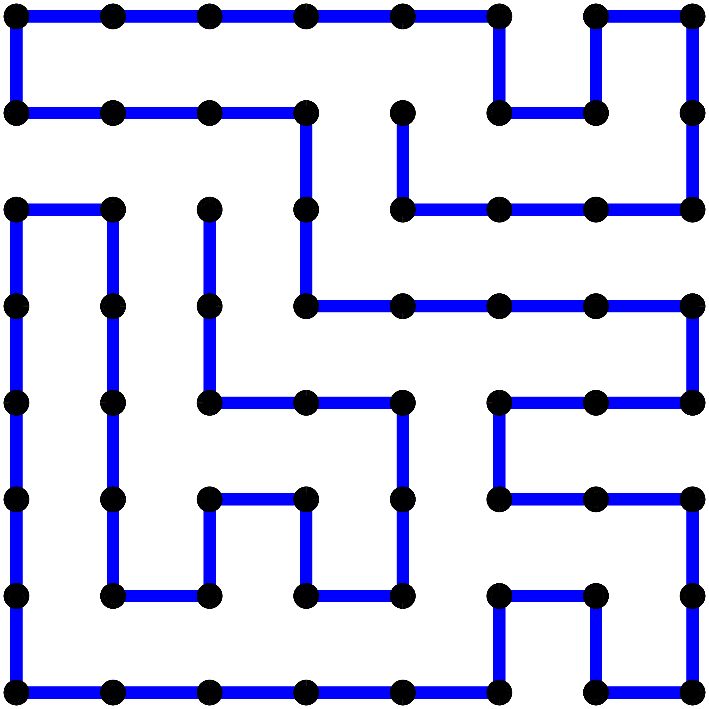
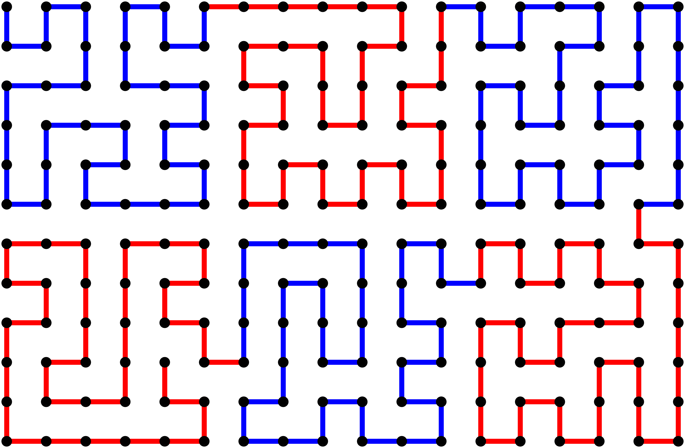
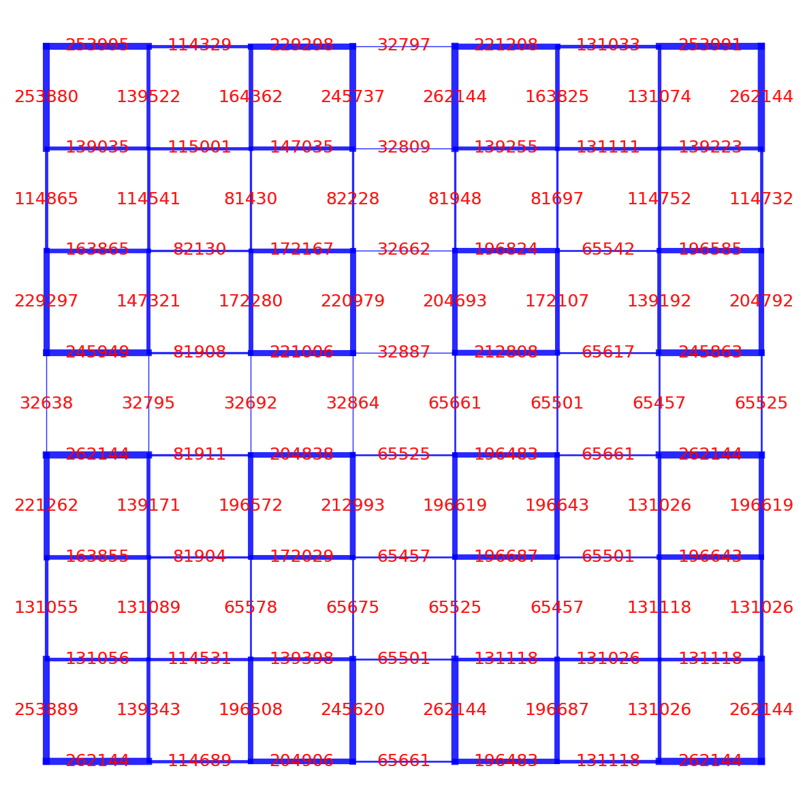
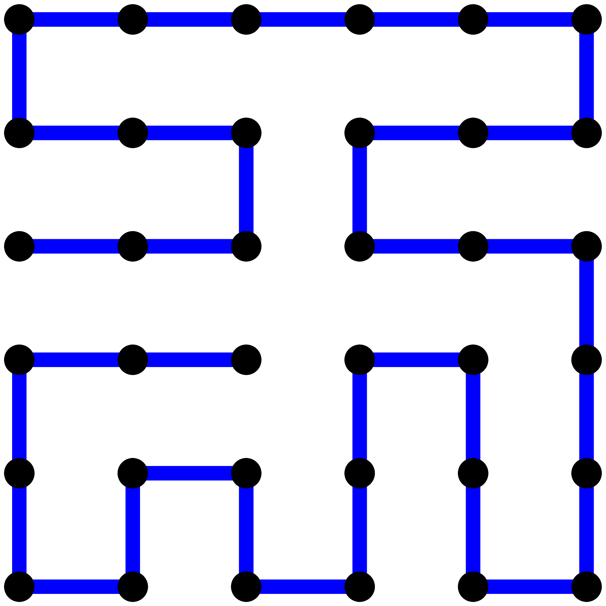
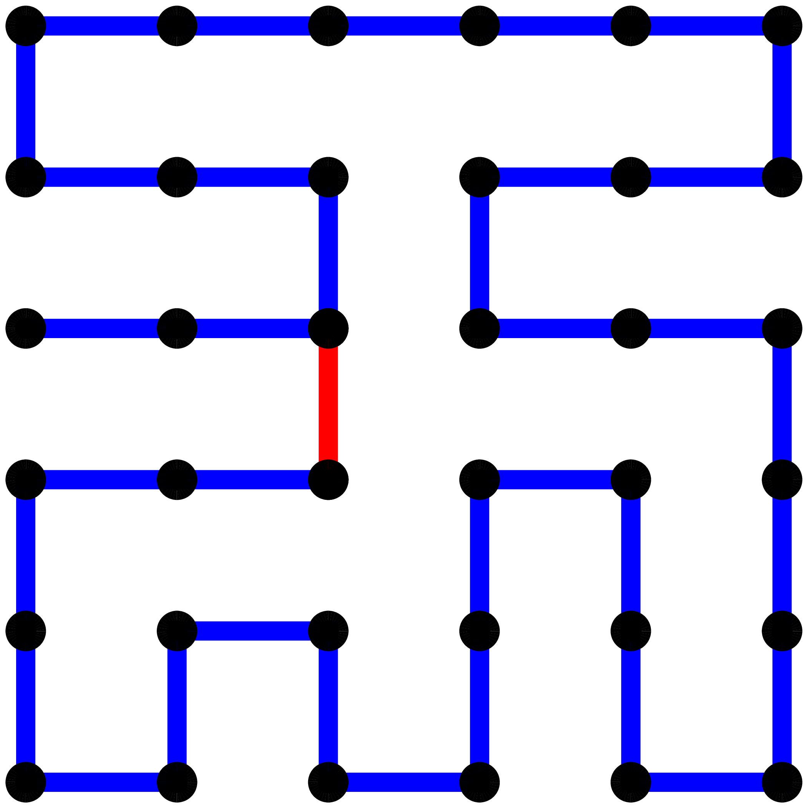
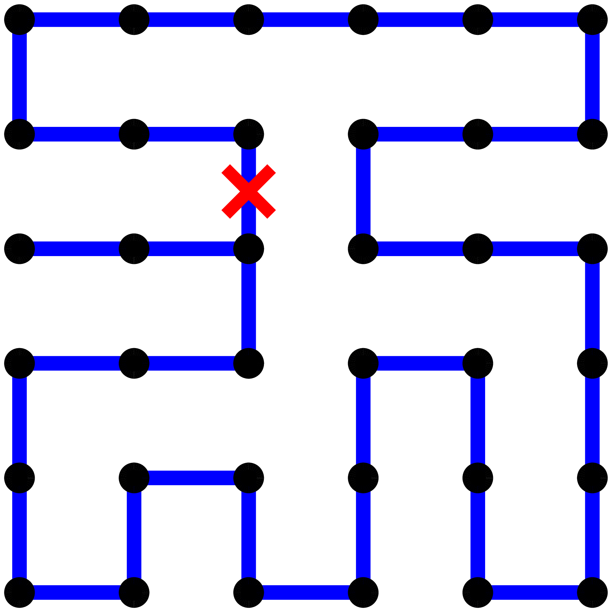
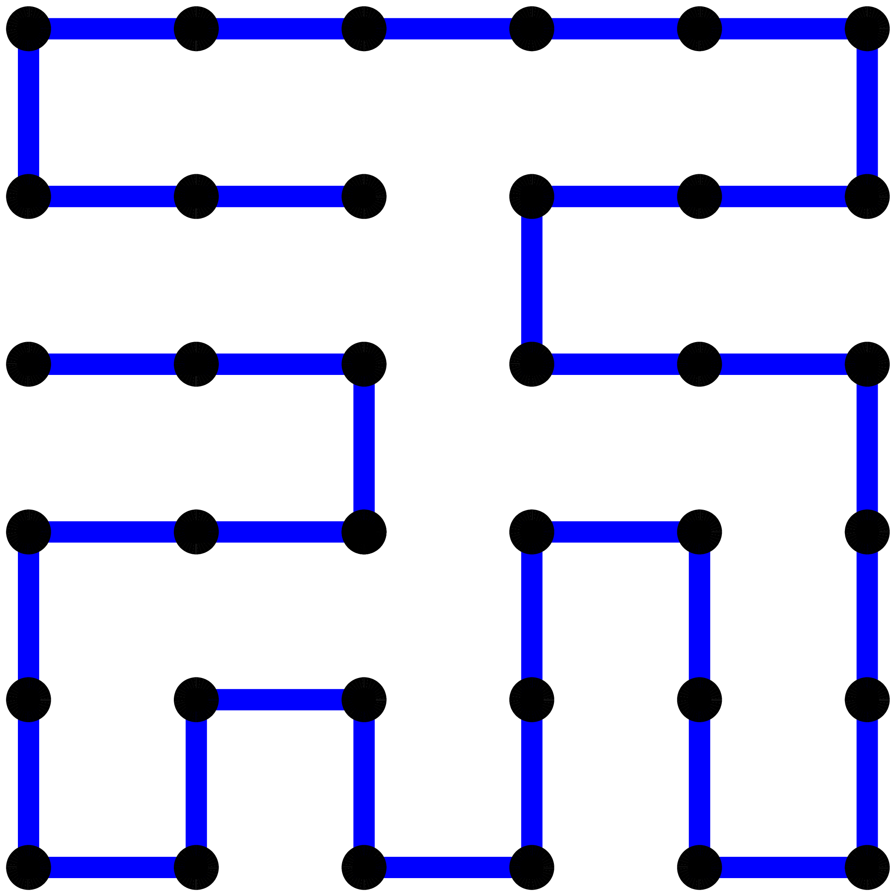
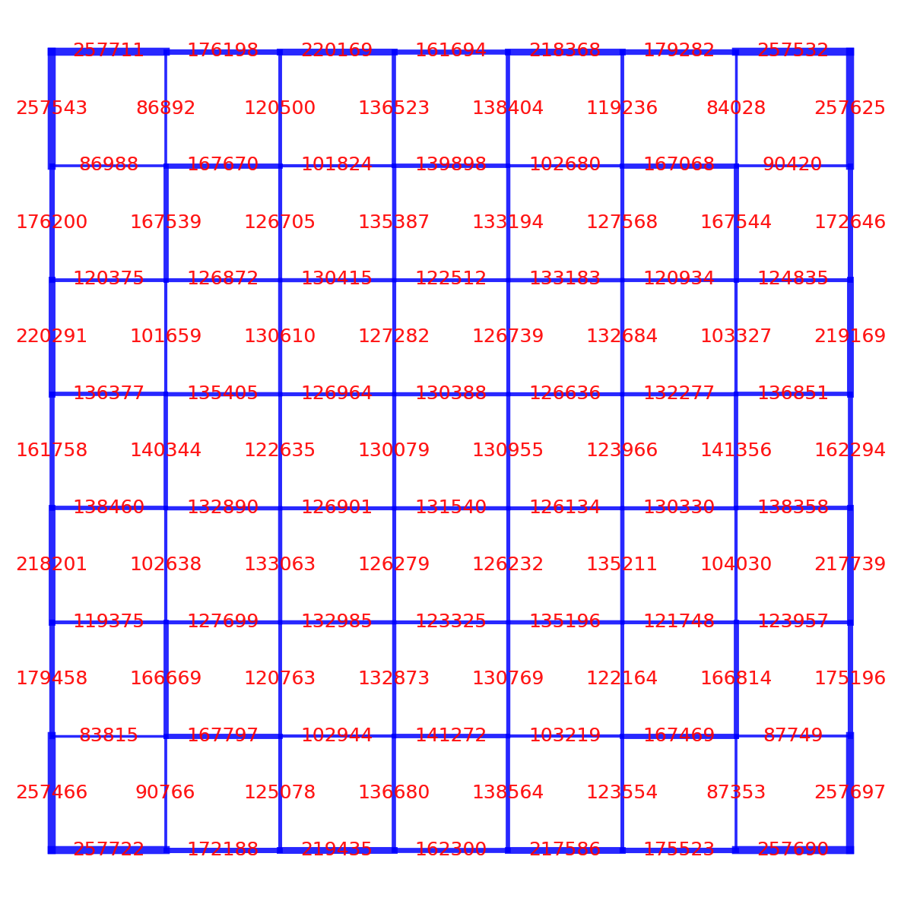

Consider the grid  $G = \lbrace 0, 1, \dots, m-1\rbrace \times \lbrace 0, 1, \dots, n-1\rbrace$.  A Hamiltonian path on $G$ is a sequence of distinct points $(v_0, v_1, \dots, v_{m n - 1})$ in $G$ such that 
1. Every consecutive pair $(v_i, v_{i+1})$ corresponds to 4-neighborhood adjacent points on the grid, meaning that if $v_i = (a_i, b_i)$ and $v_{i+1} = (a_{i+1}, b_{i+1})$, then $|a_i - a_{i+1}| + |b_i + b_{i+1}| = 1$. 
2. The sequence visits every point of the grid exactly once, that is $\lbrace v_0, v_1, \dots, v_{mn-1}\rbrace = G$.

Equivalently, a Hamiltonian path is a walk that moves through all grid points exactly once, where each step adds one of the four possible direction vectors
```C++
const std::array<std::pair<int, int>, 4> directions = {{
				 {0, 1}, {1, 0}, {0, -1}, {-1, 0}
}};
```

The Figure below shows an example of a Hamiltonian path on an $8 \times 8$ grid. 

<div style="text-align:center;">
  <figure style="max-width:300px; margin: 0 auto;">
    
    <figcaption>Hamiltonian path on a $8 \times 8$ grid</figcaption>
  </figure>
</div>

In this post, I discuss some efforts to generate random Hamiltonian paths on a grid. We start by defining a `Grid` class, which stores its dimensions (`heigh` and `width`) and an optional offset `bias` that allows positioning it in global coordinates.
```C++
using Point = std::pair<int, int>;
using Points = std::vector<Point>;

class Grid{
private:
	std::mt19937 rng;  
public:
	int height, width;
	Point bias;
	
	// A constructor
    Grid(int h, int w, Point b) : 
	height(h), width(w), bias(b){
        rng = std::mt19937(std::random_device{}());
    }
	
	// A helper function that checks if a given coordinate is within bounds 
	bool is_valid(Point p){
		int local_y = p.first - bias.first;
		int local_x = p.second - bias.second;
		return local_y >= 0 && local_y < height &&
			   local_x >= 0 && local_x < width;
	}
};
```

### 1. Backtracking

Sampling random uniformly distributed Hamiltonian paths in a grid is more complicated than it seems. A natural first idea is to walk randomly over it, backtracking upon reaching a dead end. To implement this, we maintain a boolean matrix  `std::vector<std::vector<bool>> visited` to record which vertices have already been explored, while `Points path` actually stores the sequence of visited coordinates. We also allow an optional constraint on the ending positions, represented as a vector of coordinates `Points target_end`. 

```C++
// A Backtracking function
bool backtrack(Point start,
			   std::vector<std::vector<bool>>& visited,
			   Points& path,
			   const Points& target_end = {}){
	
	int local_y = start.first - bias.first;
	int local_x = start.second - bias.second;

	// Mark current cell
	visited[local_y][local_x] = true;
	path.push_back(std::make_pair(start.first, start.second));

	// Check if we found a complete valid path
	if (path.size() == static_cast<size_t>(width * height)){
		if (!target_end.empty()){
			// Check if path satisfies target end constraint
			for (const auto& [ty, tx] : target_end){
				if (start.first == ty && start.second == tx){
					return true;
				}
			}
			visited[local_y][local_x] = false;
			path.pop_back();
			return false;
		}else{
			return true;
		}
	}

	// Get current neighbors
	Points neighbors;
	for (const auto& [dy, dx] : directions){
		int ny = start.first + dy;
		int nx = start.second + dx;
		Point neighbor = std::make_pair(ny, nx);
		int local_ny = ny - bias.first;
		int local_nx = nx - bias.second;
		if (is_valid(neighbor) && !visited[local_ny][local_nx]){
			neighbors.push_back(neighbor);
		}
	}

	// Try each neighbor in shuffled order
	std::shuffle(neighbors.begin(), neighbors.end(), rng);
	for (const auto& [ny, nx] : neighbors){
		Point neighbor = std::make_pair(ny, nx);
		if (backtrack(neighbor, visited, path, target_end)){
			return true;
		}
	}

	// Backtrack
	visited[local_y][local_x] = false;
	path.pop_back();
	return false;
}

// A wrapper to the backtracking function
Points sample_path(Point start, 
				   const Points& target_end = {}){

	std::vector<std::vector<bool>> visited;
	Points path;
	
	path.clear();
	visited = std::vector<std::vector<bool>>(height, std::vector<bool>(width, false));

	// Start backtracking
	if (backtrack(start, visited, path, target_end)){ 
		return path;
	}
	
	return {}; 
}
```

The recursive backtracking algorithm attempts to extend the current path by moving to unvisited neighboring vertices in a random order. When the path eventually covers all vertices and, if applicable, ends inside the target end region, the algorithm terminates successfully.  The $8 \times 8$ example we showed earlier was generated with this backtracking routine.

Unfortunately, although the method works as intended, its runtime is terrible. In my attempts, once the grid size exceeds $mn = 36$, execution becomes prohibitively slow. Indeed, from a holistic perspective, at any given cell, we have up to $4$ possible moves and we try almost all possible orderings, which makes the complexity something exponential like $O(4^{mn})$ in the worst case. In fact, finding a Hamiltonian path is an NP-complete problem so we shouldn't expect our naive approach do much better than that. 

### 2. Pyramid construction

So, backtracking runs in exponential time, which makes it inefficient. However, it is not useless: for very small grids, the algorithm behaves as if its execution time were linear. In this section we try to explore that. Recall that our backtracking implementation takes a `target_end` constraint, which represent a region of the grid where the path is required to end. Constraining the endpoint to a single coordinate may be too restrictive, but we can reasonably restrict it for an entire side of the grid (`top`, `bottom`, `left`, `right`), without significantly affecting performance. To support this in a simple way, we  can write another implementation of `sample_path` function that parses an `end_side` string and calls the previously defined wrapper. 
```C++
// Alternative wrapper to find a random path using an end_side string
Points sample_path(Point start,
				   const std::string& end_side){

	Points target_end;

	// Parse end_side to sample target_end positions
	if (end_side == "top"){
		int y = bias.first;  // topmost row
		for (int x=bias.second; x<bias.second+width; x++) {
			target_end.push_back({y, x});
		}
	}
	else if (end_side == "bottom"){
		// Bottom row
		int y = bias.first + height - 1;
		for (int x=bias.second; x<bias.second+width; x++){
			target_end.push_back({y, x});
		}
	}
	else if (end_side == "left"){
		// Leftmost column
		int x = bias.second;
		for (int y=bias.first; y<bias.first+height; y++){
			target_end.push_back({y, x});
		}
	}
	else if (end_side == "right"){
		// Rightmost column
		int x = bias.second + width - 1;
		for (int y=bias.first; y<bias.first+height; y++) {
			target_end.push_back({y, x});
		}
	}
	else if (end_side == "any"){
		return sample_path(start);
	}

	// Sample path
	return sample_path(start, target_end);
}
```

Together with the global bias in `Grid` implementation, this allows us to join two random paths whose sides have matching lengths. As an example, the snippet bellow shows how to connect six random paths, each defined on a $6 \times 6$ grid. 
```C++
Point start = {0,0};
Point end;
Points path_swap, path;
Grid subgrid(6,6, start);

// First subgrid (0,0) to (0,1)
path = subgrid.sample_path(start, "right");

// Second subgrid (0,1) to (0,2) 
subgrid.bias = {0*6, 1*6};
start = path.back();
start.second++;
path_swap = subgrid.sample_path(start, "right");
path.insert(path.end(), path_swap.begin(), path_swap.end());

// Third subgrid (0,2) to (1,2) 
subgrid.bias = {0*6, 2*6}; 
start = path.back();
start.second++;
path_swap = subgrid.sample_path(start, "bottom");
path.insert(path.end(), path_swap.begin(), path_swap.end());

// Fourth subgrid (1,2) to (1,1) 
subgrid.bias = {1*6, 2*6}; 
start = path.back();
start.first++;
path_swap = subgrid.sample_path(start, "left");
path.insert(path.end(), path_swap.begin(), path_swap.end());

// Fifth subgrid (1,1) to (1,0) 
subgrid.bias = {1*6, 1*6};
start = path.back();
start.second--;
path_swap = subgrid.sample_path(start, "left");
path.insert(path.end(), path_swap.begin(), path_swap.end());

// Sixth subgrid (1,0) to (0,0) 
subgrid.bias = {1*6, 0*6};
start = path.back();
start.second--;
path_swap = subgrid.sample_path(start, "any");
path.insert(path.end(), path_swap.begin(), path_swap.end());
```

Notice the iterative aspect of this construction. The random paths in each $6 \times 6$ grid were connected along an underlying deterministic path on a $2 \times 3$ super-grid.  Using this approach, we obtain a Hamiltonian path on a $12 \times 18$ grid. The Figure below shows a path sampled in this manner, with alternating colors to highlight each joining step.

<div style="text-align:center;">
  <figure style="max-width:700px; margin: 0 auto;">
    
    <figcaption>Joining randomly sampled Hamiltonian paths</figcaption>
  </figure>
</div>


Generalizing this idea, we can write a function that takes a path on a “low resolution” grid and follows it point by point, backtracking random paths at each location and joining them to produce a random Hamiltonian path on a “higher resolution” grid.
```C++
Points sample_path_pyramid(const Points& lowres_path,
                           int lowres_m, int lowres_n,
                           int subgrid_m, int subgrid_n,
                           std::mt19937& rng){

    // Full and subgrid paths
    Points full_path;
    Points subgrid_path;

    Grid subgrid(subgrid_m, subgrid_n, {0,0});
    
    for (size_t i=0; i<lowres_path.size(); i++){
        int lowres_y = lowres_path[i].first;
        int lowres_x = lowres_path[i].second;
        subgrid.bias = {lowres_y*subgrid_m, lowres_x*subgrid_n};

        // Determine end side for subgrid
        std::string end_side = "any";
        if (i < lowres_path.size() - 1){
            int lowres_y_next = lowres_path[i+1].first;
            int lowres_x_next = lowres_path[i+1].second;
            if (lowres_y_next == lowres_y + 1){
                end_side = "bottom";
            }else if (lowres_y_next == lowres_y - 1){
                end_side = "top";
            }else if (lowres_x_next == lowres_x + 1){
                end_side = "right";
            }else if (lowres_x_next == lowres_x - 1){
                end_side = "left";
            }
        }else{
            end_side = "any";
        }   

        // sample path in subgrid
        subgrid_path.clear();
        while(subgrid_path.empty()){
            // Find a starting position at the edge of the subgrid
            Point start;
            if (i > 0){
                int lowres_y_prev = lowres_path[i-1].first;
                int lowres_x_prev = lowres_path[i-1].second;
                // Get the last random position from the previous subgrid
                Point last_pos = full_path.back();

                // Compute new start 
                start.first = last_pos.first;
                start.second = last_pos.second;
                
                // Increment according to direction
                if (lowres_y_prev < lowres_y){
                    start.first += 1;
                }else if (lowres_y_prev > lowres_y){
                    start.first -= 1;
                }else if (lowres_x_prev < lowres_x){
                    start.second += 1;
                }else if (lowres_x_prev > lowres_x){
                    start.second -= 1;
                }

            }else{
                // First subgrid, can start anywhere
                Points possible_starts;
                for (int yy = lowres_y*subgrid_m; yy < lowres_y*subgrid_m + subgrid_m; yy++){
                    for (int xx = lowres_x*subgrid_n; xx < lowres_x*subgrid_n + subgrid_n; xx++){
                        possible_starts.push_back({yy, xx});
                    }
                }

                std::uniform_int_distribution<> dis(0, possible_starts.size() - 1);
                int rand_index = dis(rng);
                start.first = possible_starts[rand_index].first;
                start.second = possible_starts[rand_index].second;
            }

            // sample path in subgrid
            subgrid_path = subgrid.sample_path(start, end_side);
        }
        
        full_path.insert(full_path.end(), subgrid_path.begin(), subgrid_path.end());
    }

    return full_path;
}
```

At each position of  the input `lowres_path`, the function `sample_path_pyramid`  creates a random Hamiltonian path by backtracking over the  smaller `subgrid_m` $\times$ `subgrid_n` grid, using appropriate `start` positions and `target_end` constraints. These subgrid paths are then joined together following `lowres_path`, yielding a final path on a grid of size `lowres_m` `subgrid_m` $\times$ `lowres_n` `subgrid_n` sized grid. By calling this function iteratively with appropriately chosen dimensions, we can generate a Hamiltonian path of any desired size. For example, the snippet below shows how to create a path on a `128` $\times$ `128` grid. 
```C++
std::mt19937 rng(std::random_device{}());
int lowres_m, lowres_n, subgrid_m, subgrid_n;
Points path_swap, path;  

Points mn = {
	{2,2},
	{2,2},
	{2,2},
	{2,2},
	{2,2},
	{2,2},
	{2,2}
};    

// Compute overall dimensions
int overall_m = 1, overall_n = 1;
for (const auto& dim : mn){
	overall_m *= dim.first;
	overall_n *= dim.second;
}

Grid grid(mn[0].first, mn[0].second, {0,0});
path = grid.sample_path({0,0});

for (uint8_t level=1; level<mn.size(); level++){
	lowres_m = mn[level-1].first;
	lowres_n = mn[level-1].second;
	subgrid_m = mn[level].first;
	subgrid_n = mn[level].second;

	path_swap = sample_path_pyramid(path,
									lowres_m, lowres_n,
									subgrid_m, subgrid_n,
									rng);

	path = path_swap;
}
```

Is a path generated by `sample_path_pyramid` random? In a sense, yes,  but is it uniformly distributed? Definitely not. Uniformity here is related to having each possible edge being taken with the same probability. And are all Hamiltonian paths reachable by this method? Again, no. The pyramid construction selects only one joining edge at each junction, and not every Hamiltonian path on a finer grid can be decomposed into paths on smaller, equally sized subgrids. In other words, some valid random paths can never be produced by this method, and the ones that are produced are heavily biased.

### 3. Backbiting

As we have just argued, the procedure described in the previous section neither generates uniformly random Hamiltonian paths nor is capable of producing all possible Hamiltonian paths on the grid. One way to highlight these problems of the sampler is to examine how often each edge of the grid is used after generating a large number of samples. If the algorithm was uniform, then we would expect that every edge would be visited roughly the same number of times.

The visualization below was produced by repeatedly generating Hamiltonian paths on an $8 \times 8$ grid using the iterative construction described earlier with `mn = {{2,2}, {2,2}, {2,2}}`. We ran this procedure $64^3$ times, and counted how many times each edge was used. A line was drawn for every traversal of each edge, with its thickness proportional to the number of visits. The resulting plot reveals a strong spatial bias as expected: some edges are traversed far more frequently than others.
<div style="text-align:center;">
  <figure style="max-width:600px; margin: 0 auto;">
    
    <figcaption>Edge distribution without backbiting</figcaption>
  </figure>
</div>

Although I'm not sure whether this edge-counting strategy is sufficient to indicate that the distribution is uniform, it is at least a good diagnostic for revealing non-uniformity. In my brief research, I found that the standard way for generating approximately uniformly distributed Hamiltonian paths involves some form of shuffling mechanism [1]. The commonly adopted method traces back to a 1980s Journal of Chemical Physics paper on polymer simulations [2], and it is known as backbiting.

Backbiting offers a different way of approaching the problem. Instead of constructing a random Hamiltonian path from scratch, we start with any valid Hamiltonian path, a deterministic or highly structured and biased one (as the ones we produced so far). We then modify it in place several times, applying small local moves that shuffles the path while preserving its Hamiltonian property. This iterative modification process naturally forms a Markov chain: each new path is obtained by a simple random move applied to the current one, with no memory of the steps that came before. Over many iterations, these random local rearrangements tend to explore the set of all Hamiltonian paths, and in a way that resembles a uniform sampling procedure.

The backbiting operation works as follows:
 
1. Pick one end of the path (either the first or the last point) at random.
2. Look at that endpoint’s grid neighbors (up, down, left, right) and pick one of them randomly.
3. If the chosen neighbor is not already directly connected to the endpoint, connect them.  By doing this, we end up with a cycle, since the neighbor already appears somewhere else in the path.
4. The cycle is then broken at the bite point by removing the edge that connects the chosen neighbor to the next point in the cycle, and reversing that entire segment. This restores a valid Hamiltonian path with a slightly different format.

<div style="text-align:center;">
  <table style="display:inline-block; width:auto; border-collapse:collapse;">
    <tr>
      <td style="text-align:center; padding:10px 20px;">
        <br>
        <small>1.</small>
      </td>
      <td style="text-align:center; padding:10px 20px;">
        <br>
        <small>2.</small>
      </td>
    </tr>
    <tr>
      <td style="text-align:center; padding:10px 20px;">
        <br>
        <small>3.</small>
      </td>
      <td style="text-align:center; padding:10px 20px;">
        <br>
        <small>4.</small>
      </td>
    </tr>
  </table>
</div>

I implemented backbiting as follows
```C++
void backbite(Points& path,
              int height,
              int width,
              std::mt19937& rng){
                
    std::uniform_int_distribution<> end_dis(0, 1);
    int end_index = end_dis(rng) == 0 ? 0 : path.size() - 1;
    auto [end_y, end_x] = path[end_index];

    // Collect neighbor cells within bounds
    Points neighbors;
    for (const auto& [dy, dx] : directions){
        int ny = end_y + dy;
        int nx = end_x + dx;
        if (ny >= 0 && ny < height && nx >= 0 && nx < width){
            neighbors.emplace_back(ny, nx);
        }
    } 
    
    if (neighbors.empty()){
        return;
    }

    std::uniform_int_distribution<> neigh_dis(0, neighbors.size() - 1);
    auto [bite_y, bite_x] = neighbors[neigh_dis(rng)];

    // Find bite position in the path
    auto it = std::find(path.begin(), path.end(), std::make_pair(bite_y, bite_x));
    if (it == path.end()) return;

    // If biting from the front: reverse beginning..before(it)
    if (end_index == 0){
        // Reverse from start up to but not including the bite
		// Avoid reversing a 1-element range
        if (it != path.begin()){
            std::reverse(path.begin(), it);
        }

    // If biting from the back: reverse after(it)..end
    }else{
        // Reverse from after the bite to the end
        // Avoid reversing a 1-element range
        if (it + 1 != path.end()){
            std::reverse(it + 1, path.end());
        }
    }
}
```


To compare with the previous edge-count visualization, I again sampled $64^3$ paths on a  $8 \times 8$ with the same pyramid as before. This time, however, each sampled was processed with  $64 \log 64$ backbiting operations. As expected, the resulting visualization shows a much more uniform edge count.
<div style="text-align:center;">
  <figure style="max-width:600px; margin: 0 auto;">
    
    <figcaption>Edge distribution with backbiting</figcaption>
  </figure>
</div>


Finally, the Figure below shows a random Hamiltonian path sampled on a $128 \times 128$ grid using the the iterative pyramid approach (`mn = {{2,2}, {2,2}, {2,2}, {2,2}, {2,2}, {2,2}, {2,2}}`) followed by $100 \times 128^2 \log 128^2$ backbiting operations. 

<div style="text-align:center;">
  <figure style="max-width:1000px; margin: 0 auto;">
    
    <figcaption>Hamiltonian path on a $128 \times 128$ grid</figcaption>
  </figure>
</div>


### References

**[1]** Oberdorf, R.; Ferguson, A.; Jacobsen, J. L.; Kondev, J.  
_Secondary Structures in Long Compact Polymers_ (2005).  
arXiv: https://arxiv.org/abs/cond-mat/0508094

**[2]** Mansfield, M. L.  
_Monte Carlo study of chain folding in melt-crystallized polymers._  
_Journal of Chemical Physics_ **77**, 1554–1559 (1982).  
DOI: https://doi.org/10.1063/1.443937
