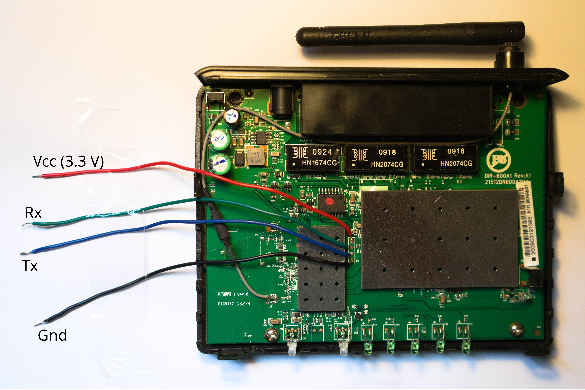
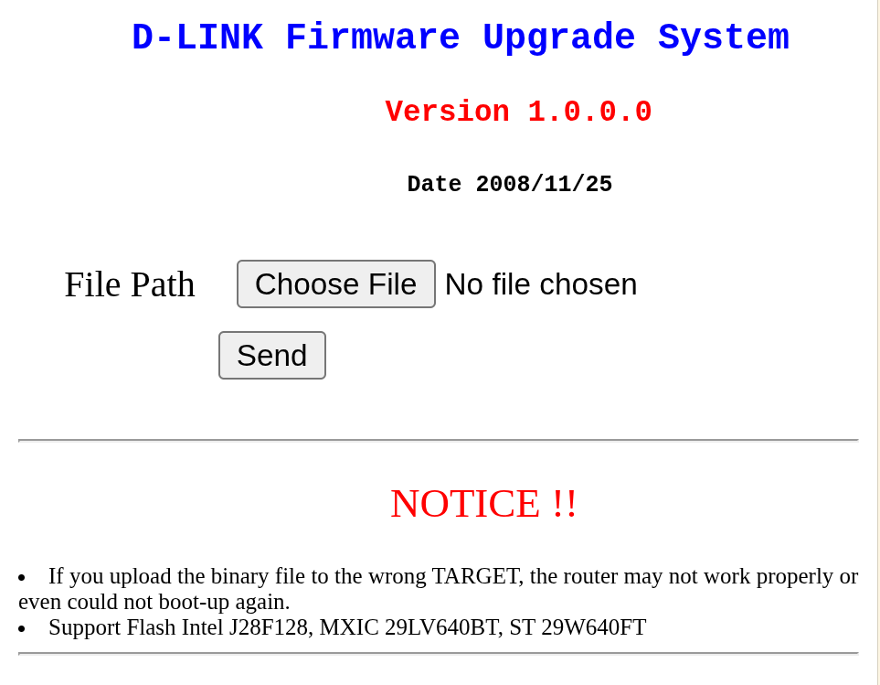

The last time I was in Maringá I found a box with ancient artifacts inside. One item caught my attention: an old friend, a D-Link DIR-601 Rev. A1. For many years my family used this router as our home wifi access point, until internet providers started to ship modems with built-in wifi. For purely nostalgic reasons, I decided to bring it back with me to Campinas. Last week I powered it on and, to my surprise, it was still working fine.

The router is old: an Atheros AR7240 SoC with a 400 MHz 32-bit MIPS 24Kc CPU, 32 MiB of RAM and 4 MiB of flash. My goal was to run OpenWrt-family firmware on it. I ended up choosing LEDE 17.01.1, the historical fork of OpenWrt that was merged later. In this note, I highlight what worked and what did not. The OpenWrt DIR-600 device page [1] was an excellent resource throughout the process.

### 1. UART interface

The board exposes a nice UART interface through the JP3 header.


The UART can be used to inspect the boot sequence and interact with the U-Boot console.

### 2. Failed attempts (TFTP and YMODEM)

My first idea was to use U-Boot's `tftpboot` client. I made a point-to-point Ethernet connection between my computer and the router and verified that the basic network configuration was working. In particular, (1) the Ethernet link was up, (2) the router was able to resolve my computer's MAC address through ARP, and (3) packet captures confirmed that the ARP exchange was working correctly. However, the TFTP download initiated by `tftpboot` never resulted in any UDP/TFTP packets reaching my computer, and U-Boot eventually timed out and exhausted its retry count.

In fact, [1] mentions that the TFTP approach may not work and suggests using YMODEM instead, through U-Boot's `loady` utility. I tried this approach as well, but it did not work either. U-Boot successfully entered YMODEM receive mode and displayed `## Ready for binary (ymodem)...`, but the transfer never started. Minicom repeatedly reported `Retry 0: Timeout on pathname`, followed by `Transfer incomplete`. After several retries, U-Boot timed out with `0(SOH)/0(STX)/0(CAN) packets` received. The YMODEM sender never sent the initial packet, so no firmware data was transferred. Instead of debugging the YMODEM sender on my Debian machine, I decided to give the default recovery mechanism a try.

### 3. D-Link Backup Mode HTTP server

After the unsuccessful U-Boot attempts, I turned to the router's built-in firmware recovery Backup Mode. To enter Backup Mode, you need to hold the reset button while powering up the router until the orange power LED starts blinking. At the same time, the UART console will show something like
```
.... (rest of boot sequence) ....
Hit any key to stop autoboot:  0
Trying eth0
eth0 link down
FAIL
Trying eth1
dup 1 speed 1000
Backup Mode
```

When the router is placed in Backup Mode, it starts a small HTTP server at `192.168.0.1`. With the point-to-point Ethernet connection to the router still in place, I configured my wired interface with the static address `192.168.0.2`
```bash
nmcli radio wifi off
sudo ip addr add 192.168.0.2/24 dev enp1s0
sudo ip link set enp1s0 up
```

After that, I was able to access the D-Link recovery page at `http://192.168.0.1`, shown below


At first, I thought it was going to work because, after selecting the binary file and clicking "Send", `tcpdump` showed some activity. However, the upload seemed extremely slow, or perhaps stuck, and then I found out that this firmware upload path also had some problems. The OpenWrt reference [1] mentions that the recovery page may require Internet Explorer 6, which I did not intend to use. In my first attempts I tried Mozilla Firefox (140.13.0esr) and Google Chrome (151.0.7922.137), but neither worked. I also tried uploading the binary file directly with `curl`
```bash
curl -F "files=@lede-17.01.1-ar71xx-generic-dir-601-a1-squashfs-factory.bin" \
     http://192.168.0.1/cgi/index
```

In all cases, the upload appeared to make progress, but at an extremely slow rate. I left the `curl` upload running overnight, and after several hours it had transferred only around 5% of the firmware image.

Researching the problem, I found a Python script [2] on GitHub called `dlink-firmware-uploader`, written specifically to upload firmware to old D-Link recovery servers. Its author, GitHub user dlitz, had investigated a similar D-Link recovery server (DIR-615 Rev. E4) and found several bugs in its TCP/IP implementation. The server identifies itself as uIP/0.9, a lightweight TCP/IP stack. In particular, the server advertises a TCP receive window of 1024 bytes, but mishandles the case where the client sends two 512-byte TCP segments to fill that window. Instead of acknowledging received data, it repeatedly sends an ACK for the previous sequence number. The client therefore interprets the packets as lost and retransmits, with increasing TCP retransmission timeouts. The resulting delays can reach several seconds between transmissions, making a normal HTTP upload unusable. The script also documents several other quirks in the recovery server, including requirements regarding how the HTTP request must be segmented and when the TCP connection can be closed. The uploader implements a specific sequence of packets that avoids these problematic cases.

I ported the script from Python 2 to Python 3 and ran it
```bash
python3 dlink-firmware-uploader/upload.py lede-17.01.1-ar71xx-generic-dir-601-a1-squashfs-factory.bin
```

This time the upload went through, and LEDE was successfully flashed. During the process, the UART console showed the following messages:
```
Backup Mode
.ENTER shift
.........................................................................................................8
Image Hardware ID is AP91-AR7240-RT-090223-02
Upgrade Firmware.........
entry point = 80060000, flash base = bf040000 total_filesize = 390018
 First 0x4 last 0x3d
  61write addr: bf040000
```

Then router then rebooted into LEDE. I could access it over SSH with
```bash
/usr/bin/ssh -o HostKeyAlgorithms=+ssh-rsa root@192.168.1.1 
```

which gave me the splash screen followed by a BusyBox shell
```  
  BusyBox v1.25.1 () built-in shell (ash)

     _________
    /        /\      _    ___ ___  ___
   /  LE    /  \    | |  | __|   \| __|
  /    DE  /    \   | |__| _|| |) | _|
 /________/  LE  \  |____|___|___/|___|                      lede-project.org
 \        \   DE /
  \    LE  \    /  -----------------------------------------------------------
   \  DE    \  /    Reboot (17.01.1, r3316-7eb58cf109)
    \________\/    -----------------------------------------------------------

=== WARNING! =====================================
There is no root password defined on this device!
Use the "passwd" command to set up a new password
in order to prevent unauthorized SSH logins.
--------------------------------------------------
root@LEDE:/# 
```

### References
**[1]** [OpenWrt, D-Link DIR-600](https://openwrt.org/toh/d-link/dir-600)

**[2]** [dlink-firmware-uploader on GitHub](https://github.com/dlitz/dlink-firmware-uploader/tree/master)
