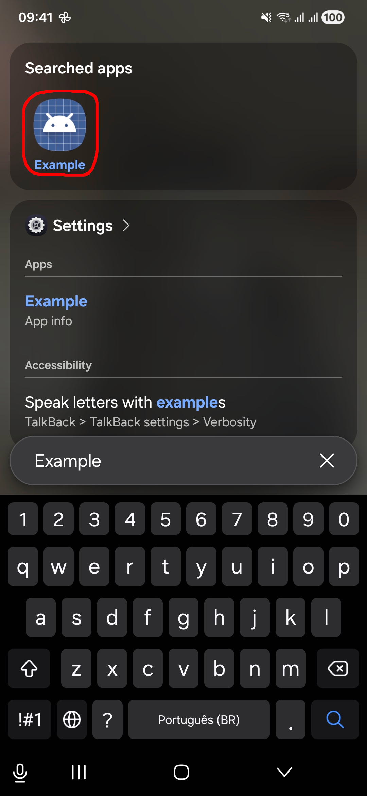
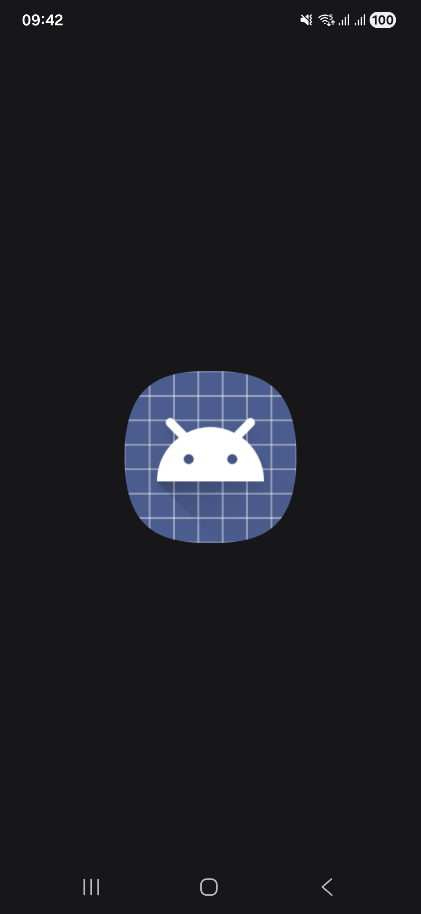

Recently I'm experimenting with performing photographic processing entirely on mobile. The paid version of Adobe Lightroom mobile is decent, but beyond that I found the number of high quality tools (especially ones capable of processing RAW files) to be scarce. 

Because of that, I decided to try building some small tools to complement the software I already use. While doing so, I spent time struggling to understand how to correctly build and install an Android application that embeds native Rust code. This post is a short report of that process and the mental model that eventually made it work.

Our goal is to build a shared library named `libexample.so`, cross-compiled on a Linux desktop for ARM64 architecture. We will have a small Android application that loads `libexample.so` and exchanges data with it. The application itself will be responsible for interacting with the Android framework, while the heavy computation will be done inside the Rust native library.

To get the Rust compiler ready for this, you'll need to add that target via `rustup`
```bash
rustup target add aarch64-linux-android
```

### 1. Android tools and development environment  

Android applications are compiled against a specific SDK version. These SDK levels are represented by integers (for example 34, 35, 36), which correspond to particular Android platform releases. This was written with a Samsung Galaxy A53 target in mind. At the time of writing, this phone is running Android 16 with UI8.  In this text we will use SDK 34 (Android 14), which seemed reasonable when I started writing this. 

We need to get the SDK, which you can do from pre-compiled binaries provided by Google. In Arch Linux, you can also get it from the following AUR packages
```
android-sdk-build-tools
android-sdk-platform-tools
android-sdk-cmdline-tools-latest
```

These AUR packages will write the necessary tools to `/opt/android-sdk`. Some of them (`aapt`, `aapt2`, `d8`, and others) will have symlinks in `/usr/bin` as well. On the other hand, `sdkmanager`, which is the official tool for managing SDK packages from the terminal, is not symlinked by default and must be added to PATH manually by appending 
```bash
# Android SDK Command Line Tools
export ANDROID_HOME=/opt/android-sdk
export PATH="$PATH:$ANDROID_HOME/cmdline-tools/latest/bin"
```
to your `.bashrc`, or something similar.

Once you have the command line tools installed and all paths configured right, you can get the Android NDK using `sdkmanager`
```bash
sdkmanager --list | grep ndk
sdkmanager --install "ndk;27.0.12077973" # For instance
```
In order for that last command to work in Arch, you will also need to run it as `sudo`, or perhaps better, to give your user owner permissions over the `/opt/android-sdk` directory
```bash
sudo chown -R $USER:$USER /opt/android-sdk
```

The Android Debugger Bridge (`adb`) is the primary command line tool used to communicate with Android devices. It allows you to install applications, read system logs, and interact with a device from the host desktop machine. Make sure you have it working properly. Among many other stuff,  `adb` can be used to probe a device in debug mode connected via USB to the host machine with
```bash
adb devices
```

If the output looks like
```bash
List of devices attached
ABCDEFGHIJK	device
```
then your device is detected and you are good to go. 

### 2. Project configuration

We begin by creating a new cargo project 
```bash
cargo new example --lib
cd example
```
Unless otherwise mentioned, all paths in this note will be relative to `example/`, which will serve as the project root. We are not going to rely on Android Studio nor Gradle, so we are free to organize the project structure as we see fit. Nonetheless, I found it convenient to have a minimal layout for build artifacts, Java sources and the native library. The following directories is what I've been using.
```bash
mkdir -p build
mkdir -p obj
mkdir -p java/com/example
mkdir -p obj
mkdir -p res
mkdir -p lib/arm64-v8a
```

At some point, you will need to run 
```bash
keytool -genkeypair \
 -keystore debug.keystore \
 -alias androiddebugkey \
 -storepass android \
 -keypass android \
 -keyalg RSA \
 -keysize 2048 \
 -validity 10000 \
 -dname "CN=Android Debug,O=Android,C=US"
```
inside the project root to generate a key used to sign the APK. 

I've been using the following `Cargo.toml` in the experiments I made. 
```toml
[package]
name = "example"
version = "0.1.0"
edition = "2021"

[lib]
crate-type = ["cdylib"]

[dependencies]
android-activity = { version = "0.6", features = ["native-activity"] }
jni = "0.21"
log = "0.4"
android_logger = "0.13"
```
I recommend reading about `android-activity` and `jni` crates. Check out their documentation: https://docs.rs/android-activity/latest/android_activity/, https://docs.rs/jni/latest/jni/.

I also had to add the following content to `.cargo/config.toml` in order to have linking done correctly
```toml
[target.aarch64-linux-android]

linker = "/opt/android-sdk/ndk/27.0.12077973/toolchains/llvm/prebuilt/linux-x86_64/bin/aarch64-linux-android34-clang"
```

### 3. Android Activities

When an app starts, the system expects to launch an Activity, which is essentially a UI screen managed by the operating system and typically written in Java or Kotlin. Activities are part of the Android framework provided by the Android Runtime (ART). Android roughly performs the following sequence
```
start app -> Create Activity object -> Call onCreate method
```
Activities are one of the fundamental building block of an APK. These, with other components an application may use, are declared to the operating system through the `AndroidManifest.xml` file.  We will use the following minimal `AndroidManifest.xml` file, which I created at project root.
```xml
<manifest xmlns:android="http://schemas.android.com/apk/res/android"
    package="com.example">
    <uses-sdk
        android:minSdkVersion="26"
        android:targetSdkVersion="34"/>

    <application android:label="Example">
        <activity
            android:name=".MainActivity"
            android:exported="true">
            <intent-filter>
                <action android:name="android.intent.action.MAIN"/>
                <category android:name="android.intent.category.LAUNCHER"/>
            </intent-filter>
        </activity>
    </application>
</manifest>
```

Android also provides a `NativeActivity`, which allows the application to start directly from native code. However, in practice I found it easier to interact with other parts of the operating system when using a small amount of Java. By writing a minimal Java activity to bootstrap the application and then calling into native code, it becomes much simpler to access Android framework features and system services than when relying entirely on `NativeActivity`. 

The basic boilerplate code for our `MainActivity` is the following
```java
package com.example;

import android.app.Activity;
import android.os.Bundle;
import android.util.Log;

public class MainActivity extends Activity {
	static {
		System.loadLibrary("example");
	}
	
	@Override
	protected void onCreate(Bundle savedInstanceState) {
		super.onCreate(savedInstanceState);
	}
}
```
and should be added to `java/com/example/MainActivity.java`.  Notice how our `MainActivity` does absolutely nothing so far, except loading the `libexample.so`. Here, we override the `OnCreate` method, which will serve as the entry point from which we can call functions implemented inside `libexample.so`.

### 4. A first example

Communication between Java and native code on Android is performed through the Java Native Interface (JNI). JNI defines a convention that allows Java code to invoke functions implemented in native libraries such as the Rust one we are willing to write. It allows our native code to interact with objects managed by the Java runtime.

In this first example we will expose a simple native function
```java
public native void run();
```
inside the class `com.example.MainActivity`. We will add a call to that function inside the overloaded version of `onCreate`. The full `java/com/example/MainActivity.java` becomes
```java
package com.example;

import android.app.Activity;
import android.os.Bundle;
import android.util.Log;

public class MainActivity extends Activity {
	public native void run();
	
	static {
		System.loadLibrary("example");
	}
	
	@Override
	protected void onCreate(Bundle savedInstanceState) {
		super.onCreate(savedInstanceState);
		Log.i("example", "Calling native function...");
		run();
	}
}
```

The runtime will look for a symbol in the loaded library with the following name
```
Java_com_example_MainActivity_run
```
In general, the pattern used by JNI is `Java_<package>_<class>_<method>`, where dots in the package name are replaced by underscores. When the activity calls `run`, the Android runtime searches the loaded shared libraries for a symbol with this name and transfers execution to it if found. 

Since Rust normally applies name mangling to its functions, we must explicitly export the symbol using the `#[no_mangle]` attribute and declare the function with the `extern "system"` calling convention. This ensures that the compiled library exposes a symbol with the exact name expected by the JNI runtime. The following block is an example implementation of the `run` function inside the Rust native library (`src/lib.rs`). 
```rust
use jni::JNIEnv;
use jni::objects::JObject;
use log::info;

#[no_mangle]
pub extern "system"
fn Java_com_example_MainActivity_run(
	_env: JNIEnv,
	_obj: JOBject
) {
	// Initialize Android logger
	// This allows `info!` macro messages to be visible 
	// in `adb logcat` 
	android_logger::init_once(
		android_logger::Config::default()
		.with_tag("example")
		.with_max_level("log::LevelFilter::Info")
	);
	
	loop {
		std::thread::sleep(std::time::Duration::from_secs(1));
		info!("Running...");
	}
}
```

### 5. APK generation

The following lines are the complete build process I'm using. It includes compilation of native Rust and java code, APK creation, linking, aligning and signing.
```bash
# Compile Rust code
cargo build --target aarch64-linux-android --release

# Copy native library
cp target/aarch64-linux-android/release/libexample.so lib/arm64-v8a

# Compile Java code
javac -classpath /opt/android-sdk/platforms/android-34/android.jar \
  -d obj/ java/com/example/MainActivity.java

# Convert to dex
d8 --lib /opt/android-sdk/platforms/android-34/android.jar \
  obj/com/example/MainActivity.class

# Create base APK
aapt2 link \
  -o base.apk \ 
  -I /opt/android-sdk/platforms/android-34/android.jar \
  --manifest AndroidManifest.xml

# Add dex
zip -u base.apk classes.dex

# Add native library to APK
zip -u base.apk lib/arm64-v8a/libexample.so

# Align APK
zipalign -f 4 base.apk app-aligned.apk

# Sign APK
apksigner sign \
  --ks debug.keystore \
  --ks-pass pass:android \
  app-aligned.apk
```

Installing the APK can be done by running
```bash
adb install -r app-aligned.apk
```

<div style="display: flex; gap:  30px; justify-content: center; align-items: center;">  

   
</div>


Now write "example" in the search box, you should find a generic icon with that name. If everything went well, the app will open (and stay open, for that matter).  You can read the adb logs  by running  
```bash
adb logcat | grep example
```
and you should find some lines like  
```
Running...
Running...
Running...
```
there.

### 6. A second example

In the previous example we verified that we can successively call a function implemented in Rust from our Java Activity. Now we move one step further and make this interaction more useful. 


#### 6.1. Java code
Remember my goal is to work with images. A basic workflow I have in mind is
```
Open image -> process image -> save new image
```

To achieve that, we will need a new native function that operates on file descriptors 
```
public native void processFile(int inputFd, int outputFd);
```

However, before calling `processFile`, we now need the Java side to:
1. Let the user select a file.
2. Obtain a file descriptor for that file.
3. Create an output file.
4. Pass both file descriptors to the native code.

Android does not expose file paths directly in most cases. Instead, it uses a higher-level abstraction based on URI and Intents. An Intent is a message used to request an action from another component (Possibly from another app). In this case, we use it to ask the system to let the user pick a file. Inside `onCreate`
```java
Intent intent = new Intent(Intent.ACTION_OPEN_DOCUMENT);
intent.setType("*/*");
startActivityForResult(intent, PICK_FILE);
```

The first three lines tell the system to "Open a file picker and let the user choose a document". When the user selects a file, the result is delivered asynchronously to `onActivityResult`. 

After the file is picked, Android returns a Uniform Resource Identifier (URI). An URI is not a file path. It is a reference, managed by the Android system that allows controlled access to the underlying data. To actually read the file, we must ask the system for a raw integer file descriptor using the `ContentResolver`, which is what we want to pass for the native library. 
```java
Uri uri = data.getData();

ParcelFileDescriptor pinput = 
    getContentResolver().openFileDescriptor(uri, "r");
int inFd = pinput.detachFd();
```

We also need a place to write the processed result. Instead of manually handling file paths, we again rely on the system. The following lines create a new entry in the system media store (the gallery), and get a raw integer file descriptor for that URI.  
```java
Uri outUri = getContentResolver().insert(
    android.provider.MediaStore.Images.Media.EXTERNAL_CONTENT_URI,
    new android.content.ContentValues()
);

ParcelFileDescriptor poutput =
    getContentResolver().openFileDescriptor(outUri, "w");

int outFd = poutput.detachFd();
```

And now, with both `inFd` (input image) and `outFd` (output image) file descriptors available, we can finally call our Rust function
```java
processFile(inFd, outFd);
```
At this point, control is transferred to the native library, which is responsible for processing the content of `inFd` and saving the result to `outFd`.

In summary, our `java/com/example/MainActivity.java` should look something like this
```java
package com.example;

import android.app.Activity;
import android.os.Bundle;
import android.net.Uri;
import android.util.Log;
import android.os.ParcelFileDescriptor;
import android.content.Intent;

public class MainActivity extends Activity {
    static final int PICK_FILE = 1;
    static {
        System.loadLibrary("example");
    }
    public native void processFile(int inputFd, int outputFd);
	
    @Override
    protected void onCreate(Bundle savedInstanceState) {
        super.onCreate(savedInstanceState);

		Intent intent = new Intent(Intent.ACTION_OPEN_DOCUMENT);
		intent.setType("*/*");
		startActivityForResult(intent, PICK_FILE);
    }

    @Override
    protected void onActivityResult(int requestCode, int resultCode, Intent data){
        if (requestCode == PICK_FILE && resultCode == RESULT_OK){
		    Uri uri = data.getData();
		    
	    try {
            ParcelFileDescriptor pinput = 
	            getContentResolver().openFileDescriptor(uri, "r");
			int inFd = pinput.detachFd();

			Uri outUri = getContentResolver().insert(
			    android.provider.MediaStore.Images.Media.EXTERNAL_CONTENT_URI,
			    new android.content.ContentValues()
			);

			ParcelFileDescriptor poutput = 
				getContentResolver().openFileDescriptor(outUri, "w");
                
			int outFd = poutput.detachFd();

			processFile(inFd, outFd);
	    } catch (Exception e) {
			Log.e("example", "Error", e);
	    }
	}
	
	// Returns to the previous screen (home in this case)
	finish();
    }
}
```


#### 6.2.  Rust code

For starters, add `image = 0.25` as a dependence in `Cargo.toml`. It provides some basic image encoding and decoding utilities. We can now extend our native library with an implementation of the `processFile` function, which will be exposed to the Android runtime as the `Java_com_example_MainActivity_processFile` symbol, following the same JNI naming convention we used earlier for the  `run` function. 

```rust
use jni::JNIEnv;
use jni::objects::JObject;
use log::info;
use std::fs::File;
use std::os::unix::io::FromRawFd;
use image::{ImageReader, ImageFormat};
use image::DynamicImage;

#[no_mangle]
pub extern "system"
fn Java_com_example_MainActivity_processFile(
    _env: JNIEnv,
    _obj: JObject,
    input_fd: i32,
    output_fd: i32,
) {	
	// Convert file descriptors into Rust objects
	// This requires unsafe because Rust assumes ownership
	// of the file descriptor. The descriptor will be closed
	// when File is dropped.
    let input = unsafe { File::from_raw_fd(input_fd) };
    let mut output = unsafe { File::from_raw_fd(output_fd) };

    // Decode image as a DynamicImage type
    let img = ImageReader::new(std::io::BufReader::new(input))
        .with_guessed_format()
        .unwrap()
        .decode()
        .unwrap();

    // Convert to RGBA buffer
    let mut img = img.to_rgba8();

    // Invert colors of each pixel 
    for pixel in img.pixels_mut() {
        pixel[0] = 255 - pixel[0]; // R
        pixel[1] = 255 - pixel[1]; // G
        pixel[2] = 255 - pixel[2]; // B
    }
    
    // Write result
    let outimg = DynamicImage::ImageRgba8(img);
    outimg.write_to(&mut output, ImageFormat::Png).unwrap();
}
```

When the app runs, the selected image (a JPEG or a PNG, for instance) is passed to this function, processed (which is a dummy color inversion) and written back as a new file. Below I show an example.

<div style="display: flex; gap:  30px; justify-content: center; align-items: center;">  

   
</div>

